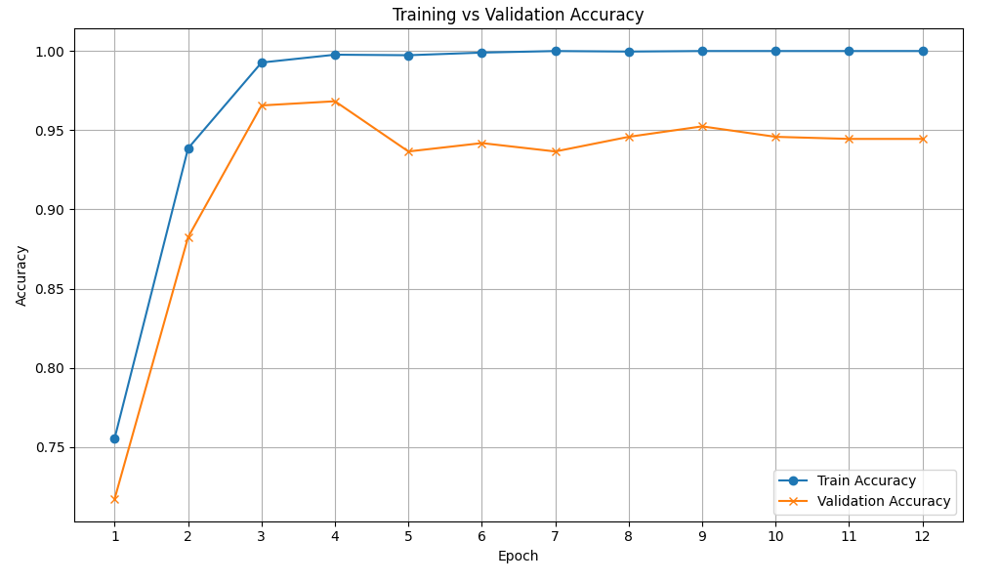

## MobileBERT를 활용한 BBC 댓글 분석 프로젝트

---

## 개요

대부분의 사람들은 댓글 작성을 번거롭게 여기며, 감상을 남기는 일은 일부에 국한된다.  
인터넷에는 댓글을 유도하기 위해 여러 가지 방법을 사용하는데, 그 중에서 다른사람을 자극하는 방법에 관심이 갔다.

대중적인 동영상 플랫폼인 유튜브는 댓글이 많이 달리면 채널의 노출도가 높아지는 등의 여러 이득을 준다.  
영상의 주제에 따라 댓글 유도 방법이 다르지만, 사람들을 더 많이 자극하여 댓글을 달게 하는 방법이 더 효과적인 방법이라고 생각한다.
이러한 전략은 실제 뉴스 기사 제목에서도 관찰된다. 예를 들어, "[[기자의 시각] 한국 야구, 팬들 책임은 없나](https://www.chosun.com/opinion/journalist_view/2023/03/27/RKR3JTOMKFHT5K4DFKUHOTPHGE/)"  
야구를 그리 좋아하지 않는 나에게도, 매우 인상적인 제목이었다. 운동선수가 부진의 책임을 팬들에게 돌리며, 많은 사람들에게 화제가 되었다.

**WIRED (2017) 에 실린 기사 “Actually, Do Read the Comments—They Can Be the Best Part”** 에서는
금융/저널 등 주요 언론사들이 댓글을 전략적으로 관리하면서,
댓글 섹션이 페이지 체류 시간, 페이지뷰 및 독자 충성도에 긍정적으로 작용했다고 설명한다.   
예시로는 파이낸셜 타임즈의 댓글 참여자는 일반 독자보다 7배 이상 더 많이 체류하며, 재방문 가능성도 높다고 한다.  
**이러한 참여의 결과는 단순한 댓글 수를 넘어, 실제 플랫폼 내 체류 시간과 사용자 충성도에도 영향을 미친다.**

**Adriel Glossary (2025)** 에 따르면, YouTube, Netflix 등 플랫폼들은 높은 Watch Time을 주요 신호로 보고 있으며, 이를 통해 추천 대상, 검색 노출 순서 결정에 적극 반영하기에 더 많이 참여하는 것이 콘텐츠 제공자에게 있어 더욱 큰 이득을 주게 된다.  
**댓글이 많고 사용자의 체류 시간이 늘어날수록, 알고리즘도 해당 콘텐츠를 더 가치 있게 판단한다는 연구도 존재한다.**

사람들을 자극하는 민감한 주제에는 댓글과 대댓글이 많이 달리고 있을 가능성이 높다.
한 댓글의 내용에 동조하고 있거나, 대립하고 있다.  
이 댓글의 내용을 충분히 분석한다면, 더욱 **댓글이 많이 달릴 민감한 주제**를 알아낼 수 있다고 생각한다.

어떤 주제에 어떤 내용이 많이 달리는지 토픽 모델링을 이용해 분석할 것이다.

## 데이터

뷰티풀수프와 셀레니움을 사용하였습니다.

### 크롤링 절차

- 셀레니움으로 동적으로 로딩된 콘텐츠를 가져오고, 뷰티풀수프로 랜더링된 html을 가져오는 식으로 크롤링을 진행하였다.

- youtube BBC 공식 유튜브 동영상 탭에서 위에서 순차대로 수집할 영상들의 url을 가져온다
- 해당 url을 타고 들어가서 동영상의 제목, 조회수, 좋아요를 수집하고, 스크롤을 내려 댓글의 내용, 좋아요, 댓글 수를 크롤링하였다.

도중에 중단하더라도 url 정보로 이어 할 수 있게 만들었다.

## 데이터 정제
| 단계 | 설명                                                                  |
|:----|:--------------------------------------------------------------------|
| **CSV 읽기** | `1combined_data.csv` 파일을 읽어 데이터를 불러온다.                                |
| **중복 제거** | 이어서 수집할 때 좋아요나 답글 수가 달라진 경우 같은 댓글의 내용이 수집되므로 중복을 제거      |
| **타입 변경** | 숫자 모양으로 수집한 데이터를 숫자 타입으로 변경          |
| **null 제거** | 좋아요가 0이면 null로 수집되어서 null을 0으로 변경                            |
| **데이터 선택** | 영상별로 4개씩 데이터를 선택                            |
| **결과 저장** | 최종적으로 필터링된 데이터를 `sampled_combdata.csv`라는 이름의 새로운 파일로 저장한다. |

**정제 결과**: 총 데이터 **2078건**을 추출하였다.

## 데이터 라벨링
| 단계 | 설명                                                                  |
|:----|:--------------------------------------------------------------------|
| **CSV 읽기** | `sampled_combdata.csv` 파일을 읽어 데이터를 불러온다.                                |
| **데이터 라벨링** | 직접 데이터를 보고 판단하여 라벨링 진행      |
| **결과 저장** | 최종적으로 라벨링된 데이터를 `comb.csv`라는 이름의 새로운 파일로 저장한다. |
| **추가 정제** | 제목 + 댓글내용, 답글 개수 이렇게 두 개만 분류해 `new_label_data.csv`에 저장한다 |

전체 데이터 - 라벨링 데이터를 하여 `new_combdata.csv`에 저장한다.

## 라벨링 데이터 EDA
- 데이터의수             : 2,078건
- 긍정(1)/부정(0) 라벨링에 대한 분포 : 90%/10%

#### 예시
| 항목     | 내용                                                                                                      |
|--------|---------------------------------------------------------------------------------------------------------|
| **제목**     | Aboard China’s ‘silver trains’ taking pensioners to tourist spots to offset tariffs \| BBC News         |
| **댓글**     | Wow .... The Chinese government is making the retired population suffer.... Drinks and Karaoke .... WFT |
| **답글**     | 0.0                                                                                                     |
| **좋아요**    | 2.0                                                                                                     |
| **조회수**    | 120000.0                                                                                                |
| **영상 좋아요** | 1200.0                                                                                                  |
| **target** | 0.0                                                                                                     |

----------------
| 항목     | 내용                                                                          |
|--------|-----------------------------------------------------------------------------|
| **제목**     | Amazon forest felled to build road for climate summit \| BBC News           |
| **댓글**     | Deforestation for a climate summit. Are they even listening to themselves?? |
| **답글**    | 7.0                                                                         |
| **좋아요**    | 417.0                                                                       |
| **조회수**    | 69000.0                                                                     |
| **영상 좋아요** | 908.0                                                                       |
| **target** | 1.0                                                                         |
--------------------

## 학습 데이터 구축

여러 영상에서 데이터를 수집하여서 각 영상별로 무작위 4개를 뽑아 총 2,078건을 학습데이터로 사용하였다.

데이터의 비율이 너무 치우쳐 있어서

    0 : 1892

    1 : 186

오버샘플링을 하여 비율을 맞춰주었다.

    0 : 1892

    1 : 1892

## 모델 학습 (MobileBERT-Finetune-GPU.py)

## 토큰화
### 토큰화 과정
| 구분            | 설명                                                                 |
|---------------|----------------------------------------------------------------------|
| **단어 토큰화**    | 각 댓글 텍스트를 단어 단위로 나누어 분석하는 과정이다              |
| **BERT 토큰화**  | MobileBERT 모델을 위한 토큰화 기법을 적용하여, 텍스트를 BERT에서 이해할 수 있는 형식으로 변환한다 |
| **Tokenizer** | BERT 토큰화를 수행하는 도구로, 문장을 토큰 ID 시퀀스로 변환한다         |

### MobileBERT 모델 설정
| 항목               | 내용                                                                 |
|--------------------|----------------------------------------------------------------------|
| **모델 아키텍처**     | MobileBERT는 BERT를 경량화하여 설계된 모델로, 경량화에도 불구하고 빠른 속도와 우수한 성능을 유지한다.          |
| **학습 데이터**       | 학습 데이터로는 샘플링된 new_label_data.csv 파일을 사용하였다.         |
| **학습 클래스의 수**  | 라벨은 총 2개로, `0(답글 적음)`과 `1(답글 많음)`으로 구성되어 있다.                                           |

### 학습 파라미터
| 항목               | 값 및 설명                                                             |
|--------------------|------------------------------------------------------------------------|
| **배치 크기**        | 16                                                                     |
| **학습률**          | 2e-5                                                                  |
| **에포크 수**        | 12                                                                  |
| **최적화 알고리즘**   | AdamW 사용                                                   |

## MobileBERT Finetuning(재학습, 미세조정)
학습 데이터와 검증 데이터를 8:2 로 나누어서 학습을 진행하였다.

    베스트 모델 저장 완료: Epoch 4 (Val Acc: 0.9683)

    Epoch 수가 올라가면 정확성이 높아졌다.

    이는 충분히 데이터 정제가 잘 되었다고 판단할 수 있다.
    
    Epoch 수가 올라간다고 무조건 높아지지는 않아 가장 높을 때를 저장하였다.

예측 이후의 데이터 분포는 0이 38255개, 1이 5022 개가 나왔다.

1의 비율이 학습 데이터에서는 20%정도이고, 예측 결과에서는 11.6% 인 것으로 보아 모델이 데이터의 불균형을 잘 이해하며 학습했다고 판단할 수 있다.
    
## Topic Modeling
여러 유튜브 영상에서 댓글들을 수집하였기 때문에 만약 토픽 모델링에서 공통된 단어가 많이 나온다면, 답글이 많이 달린 댓글들의 공통점을 추려낼 수 있다고 생각하여 토픽 모델링을 하였다.

다음은 내 토픽 모델링 결과다.

| 토픽 번호 | 주제 키워드 (상위 10개)                                              | 해석된 주제 |
|-----------|---------------------------------------------------------------------|-------------|
| 1         | god, people, like, one, time, day, man, love, world, life          | 삶과 종교, 인간 중심 감성 |
| 2         | ukraine, russia, war, peace, get, america, never, zelensky, ...    | 우크라이나 전쟁, 국제 분쟁 |
| 3         | china, american, tariff, country, u, think, well, people, ...      | 미중 무역, 글로벌 경제 |
| 4         | bbc, people, israel, hamas, right, gaza, killed, stop, human       | 이스라엘-팔레스타인 분쟁, 언론 |
| 5         | trump, u, need, want, year, would, putin, canada, europe, make     | 정치 지도자 중심 이슈 (트럼프/푸틴) |
| 6         | uk, country, news, bbc, please, state, free, back, let, u          | 영국/BBC/자유 표현 관련 |

620여 개의 영상의 댓글을 사용하였지만, 주제는 제법 잘 뭉쳤다.

최근의 영상들을 수집해서 그런지 최근 이슈 중심의 주제가 주로 도출되었다.

god, people, like, one, time, day, man, love, world, life
이런 단어들이 첫 번째 토픽에서 나왔다.

## 결론
본 과제에서는 BBC 뉴스 유튜브 영상에 달린 댓글을 수집하고, 해당 댓글이 얼마나 답글을 유도하는지를 예측하는 모델을 구축하였다.  

모델 학습 결과 약 96%의 높은 정확도를 보였으며, 토픽 모델링을 통해 전쟁, 종교, 정치, 언론 등 사회적으로 민감한 주제일수록 더 많은 댓글 반응을 유도하는 경향이 나타났다.  
직접적인 감성 분석은 수행하지 않았지만, 키워드의 맥락을 통해 주제별로 상이한 감정적 반응을 유추할 수 있었다.  
이는 사람들의 감정을 자극하는 주제가 실제로 댓글 참여도를 높이는 데 영향을 줄 수 있음을 시사한다.  
이러한 분석은 콘텐츠 제작자나 플랫폼 운영자에게 댓글 유도 전략 수립과 사용자 반응 예측에 있어 실질적인 도움을 줄 수 있다.  
향후에는 감성 분석 및 사용자별 반응 유형 분석을 추가하여, 보다 정밀한 반응 예측 시스템으로 확장할 수 있을 것이다

## 참고자료

1. WIRED (2017). ["Actually, Do Read the Comments—They Can Be the Best Part."](https://www.wired.com/story/actually-do-read-the-commentsthey-can-be-the-best-part/)
2. Adriel Glossary (2025). ["Watch Time."](https://www.adriel.com/glossary/watch-time)
