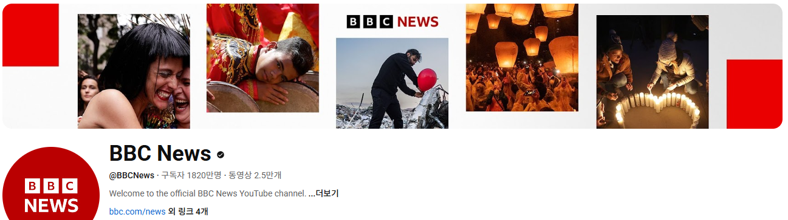
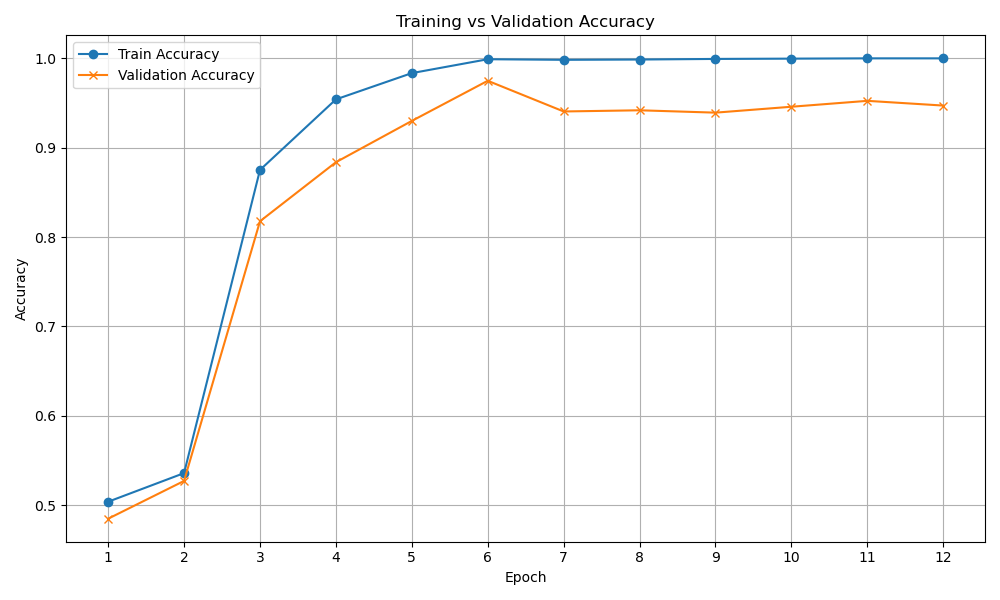
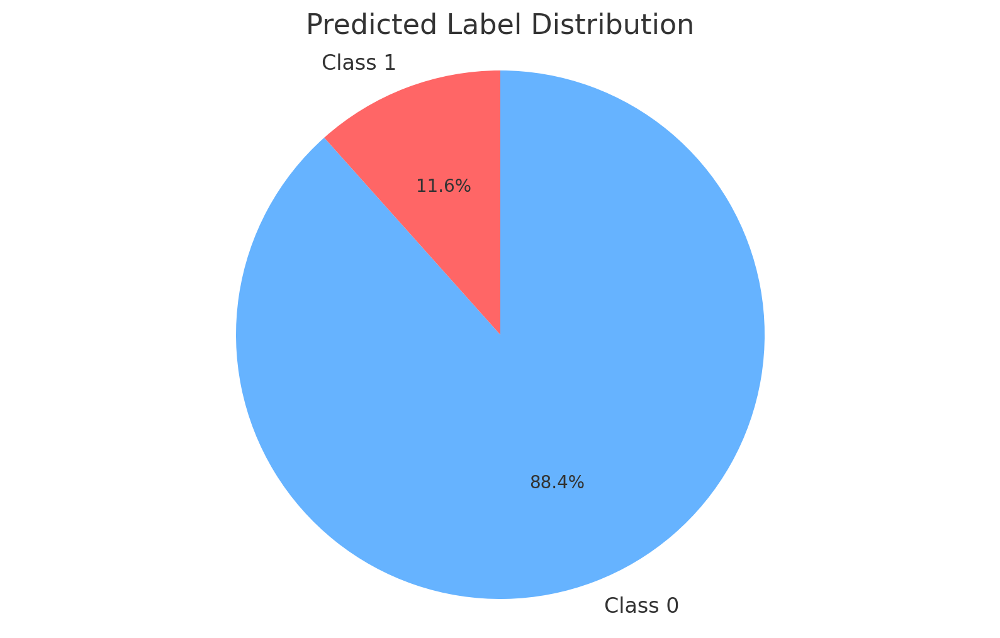

## MoblieBERT를 활용한 영화 리뷰 분석 프로젝트

---

## 개요

댓글을 작성하는 것은 번거로운 일입니다.

감상을 남기는 것은 소수의 사람을 제외하고는 잘 하지 않습니다.

인터넷에는 댓글을 유도하기 위해 여러 가지 방법을 사용하는데, 그 중에서 다른사람을 자극하는 방법에 관심이 갔습니다.

대중적인 동영상 플랫폼인 유튜브는 댓글이 많이 달리면 채널의 노출도가 높아지는 등의 여러 이득을 줍니다.

영상의 주제에 따라 댓글 유도 방법이 다르지만

저는 사람들을 더 많이 자극하여 댓글을 달게 하는 방법이 더 효울적인 방법이라고 생각합니다.

뉴스나 유튜브 동영상의 제목이 이를 반증한다고 생각합니다.

사람들을 자극하는 민감한 주제에는 댓글과 대댓글이 많이 달리고 있을 가능성이 높습니다.

한 댓글의 내용에 동조하고 있거나, 대립하고 있습니다.

이 댓글의 내용을 충분히 분석한다면, 더욱 댓글이 많이 달릴 주제를 알아낼 수 있다고 생각합니다.

## 데이터

    youtube bbc 공식 유튜브 동영상 탭에서 위에서 순차대로 url을 크롤링하고, 그 url을 타고 들어가서 동영상의 제목, 조회수, 좋아요를 수집하고, 스크롤을 내려 댓글의 내용, 좋아요, 댓글 수를 크롤링하였습니다.

## 필터링 데이터 EDA
- 데이터의수             : 2,078건건
- 긍정(1)/부정(0) 라벨링에 대한 분포 : 90%/10%
        
    여기서의 긍정/부정은 답글이 많이 달렸는가입니다.
- 라벨링 기준, 예시

    댓글과 조회수, 답글 수, 영상의 좋아요, 댓글의 좋아요를 종합적으로 보고 판단하였습니다.

#### 예시
| 항목     | 내용                                                                                                      |
|--------|---------------------------------------------------------------------------------------------------------|
| 제목     | Aboard China’s ‘silver trains’ taking pensioners to tourist spots to offset tariffs \| BBC News         |
| 댓글     | Wow .... The Chinese government is making the retired population suffer.... Drinks and Karaoke .... WFT |
| 답글     | 0.0                                                                                                     |
| 좋아요    | 2.0                                                                                                     |
| 조회수    | 120000.0                                                                                                |
| 영상 좋아요 | 1200.0                                                                                                  |
| target | 0.0                                                                                                     |

----------------
| 항목     | 내용                                                                          |
|--------|-----------------------------------------------------------------------------|
| 제목     | Amazon forest felled to build road for climate summit \| BBC News           |
| 댓글     | Deforestation for a climate summit. Are they even listening to themselves?? |
| 답글     | 7.0                                                                         |
| 좋아요    | 417.0                                                                       |
| 조회수    | 69000.0                                                                     |
| 영상 좋아요 | 908.0                                                                       |
| target | 1.0                                                                         |

## 학습 데이터 구축

총 데이터에서 10 20% 추출, 전체 데이터의 분포를 고려한 학습 데이터여야 일반화의 가능성이 높아진다.

여러 영상에서 데이터를 수집하여서 각 영상별로 무작위 4개를 뽑아 총 2,078건을 학습데이터로 사용하였습니다.

데이터의 비율이 너무 치우쳐 있어서

    0 : 1892

    1 : 186

오버샘플링을 하여 비율을 맞춰주었습니다.

    0 : 1892

    1 : 1892

## MobileBERT Finetuning(재학습, 미세조정)
학습 데이터와 검증 데이터를 8:2 로 나누어서 학습을 진행하였습니다.

    training
    Epoch 12 -- Train Loss: 0.4336 | Train Acc: 1.0000 | Val Acc: 0.9472

    epoch 수가 올라가면 정확성이 높아졌습니다.

    이는 충분히 데이터 정제가 잘 되었다고 판단할 수 있습니다.

    예측 이후의 데이터 분포는 0이 38255개, 1이 5022 개가 나왔습니다.
    
    1의 비율이 학습 데이터에서는 20%정도이고, 예측 결과에서는 11.6% 인 것으로 보아 모델이 데이터의 불균형을 잘 이해하며 학습했다고 판단할 수 있습니다.
    
## Topic Modeling
여러 유튜브 영상에서 댓글들을 수집하였기 때문에 만약 토픽 모델링에서 공통된 단어가 많이 나온다면, 답글이 많이 달린 댓글들의 공통점을 추려낼 수 있다고 생각하여 토픽 모델링을 하였습니다.

다음은 제 토픽 모델링 결과입니다.

| 토픽 번호 | 주제 키워드 (상위 10개)                                              | 해석된 주제 |
|-----------|---------------------------------------------------------------------|-------------|
| 1         | god, people, like, one, time, day, man, love, world, life          | 삶과 종교, 인간 중심 감성 |
| 2         | ukraine, russia, war, peace, get, america, never, zelensky, ...    | 우크라이나 전쟁, 국제 분쟁 |
| 3         | china, american, tariff, country, u, think, well, people, ...      | 미중 무역, 글로벌 경제 |
| 4         | bbc, people, israel, hamas, right, gaza, killed, stop, human       | 이스라엘-팔레스타인 분쟁, 언론 |
| 5         | trump, u, need, want, year, would, putin, canada, europe, make     | 정치 지도자 중심 이슈 (트럼프/푸틴) |
| 6         | uk, country, news, bbc, please, state, free, back, let, u          | 영국/BBC/자유 표현 관련 |

    620여 개의 영상의 댓글을 사용하였지만, 주제는 제법 잘 뭉쳤습니다.

    최근의 영상들을 수집해서 그런지 최근에 떠들썩한 주제가 많이 나왔습니다.

    god, people, like, one, time, day, man, love, world, life
    이런 단어들이 첫 번째 토픽에서 나왔습니다.

## 결론
여러 출력 결과물로 미루어 보았을 때, 주제에 따라 긍정적인 내용이 더 답글이 많이 달리거나, 부정적인 내용이 더 답글이 많이 달리는 것을 확인할 수 있었습니다.

이 프로젝트에서 소기했던 목표인 어떤 주제가 사람들의 댓글을 더 많이 유도하는가에는 충분히 파악할 수 있었습니다.